# 🧾 Invoice & Payment Management — n8n Workflow

A complete **Invoice & Payment Management workflow for n8n** that handles **invoices, payments and refunds end to end** from a single webhook — with API-key authentication, event routing, duplicate protection, Google Sheets as the ledger, PDFbro for PDF generation, Google Drive for storage, Resend for transactional email, and a structured response returned to the application that triggered the event.

The design goal is **reliability and state management**, not just gluing services together: every event type has its own processing path, every event is checked for duplicates *before* anything is created, records are written with a `processing` status *before* external calls happen, and each record is updated with the final status, PDF link and email timestamp when processing completes.

---

## 📁 What's here

| Path | Purpose |
|---|---|
| `workflows/invoice-payment-management.json` | The workflow — import this into n8n (55 processing nodes + 6 documentation sticky notes) |
| `samples/invoice-created.json` | Sample `invoice.created` payload |
| `samples/payment-received.json` | Sample `payment.received` payload |
| `samples/refund-created.json` | Sample `refund.created` payload |
| `samples/test-webhooks.sh` | End-to-end test script (full business cycle + negative tests) |
| `samples/sheet-template/*.csv` | Header rows for the three Google Sheets tabs |

---

## 🗺️ Architecture

```mermaid
flowchart TD
    APP[Your application] -->|POST /webhook/invoice-payment-management<br/>header: x-api-key| WH[Webhook]

    WH --> VAL[Validate Request<br/>API key + payload shape]
    VAL -->|invalid key| R401[Respond 401 Unauthorized]
    VAL -->|valid| ROUTE{Route by Event Type}
    ROUTE -->|unknown event| R400[Respond 400 Bad Request]

    ROUTE -->|invoice.created| INV[Invoice path]
    ROUTE -->|payment.received| PAY[Payment path]
    ROUTE -->|refund.created| REF[Refund path]

    subgraph INV [Invoice path]
        I1[Lookup Invoice<br/>duplicate check] -->|new| I2[Build Invoice Record<br/>totals + HTML]
        I1 -->|duplicate| RD1[Respond: duplicate]
        I2 --> I3[Create Invoice Record<br/>status = processing]
        I3 --> I4[Generate PDF — PDFbro]
        I4 --> I5[Upload to Google Drive]
        I5 --> I6[Shape PDF Result]
        I3 --> I7[Build Invoice Email]
        I7 --> I8[Send Email — Resend]
        I8 --> I9[Shape Email Result]
        I6 --> M[Merge Processing Results]
        I9 --> M
        M --> I10[Update Invoice Record<br/>status = processed + PDF URL + email ts]
        I10 --> RD2[Respond: processed]
    end

    subgraph PAY [Payment path]
        P1[Lookup Payment<br/>duplicate check] -->|new| P2[Store Payment Transaction<br/>status = processing]
        P1 -->|duplicate| RD3[Respond: duplicate]
        P2 --> P3[Get Invoice]
        P3 -->|not found| P4[Mark Payment error + Respond 404]
        P3 -->|found| P5[Compute Payment Impact<br/>balance / fully paid?]
        P5 --> P6[Update Invoice Balance]
        P6 -->|fully paid| P7[Final confirmation email]
        P6 -->|partial| P8[Payment receipt email]
        P7 --> P9[Merge + Update Payment Status]
        P8 --> P9
        P9 --> RD4[Respond: processed]
    end

    subgraph REF [Refund path]
        F1[Lookup Refund<br/>duplicate check] -->|new| F2[Store Refund Transaction<br/>status = processing]
        F1 -->|duplicate| RD5[Respond: duplicate]
        F2 --> F3[Get Invoice]
        F3 -->|not found| F4[Mark Refund error + Respond 404]
        F3 -->|found| F5[Compute Refund Impact<br/>capped at amount paid]
        F5 --> F6[Update Invoice Financial Status]
        F6 --> F7[Refund confirmation email]
        F7 --> F8[Update Refund Status]
        F8 --> RD6[Respond: processed]
    end
```



**Stack:** n8n (orchestration) · Google Sheets (records) · PDFbro (invoice PDF) · Google Drive (PDF storage) · Resend (email) · Webhook (application integration)

---

## 🚀 Setup

### 1 · Create the Google Sheet

Create a spreadsheet (any name, e.g. *“Invoice & Payment Ledger”*) with **three tabs named exactly** `Invoices`, `Payments`, `Refunds`. Import the matching CSV from `samples/sheet-template/` into each tab (or type the header row yourself):

<details>
<summary><b>Invoices</b> tab columns</summary>

`Invoice ID · Customer ID · Customer Name · Customer Email · Issue Date · Due Date · Currency · Total Amount · Amount Paid · Balance · Status · PDF URL · PDF File ID · Email Sent At · Email ID · Created At · Updated At`
</details>

<details>
<summary><b>Payments</b> tab columns</summary>

`Payment ID · Invoice ID · Amount · Currency · Method · Received At · Status · Invoice Status After · Email ID · Notes · Created At · Updated At`
</details>

<details>
<summary><b>Refunds</b> tab columns</summary>

`Refund ID · Invoice ID · Payment ID · Amount · Currency · Reason · Refunded At · Status · Invoice Status After · Email ID · Notes · Created At · Updated At`
</details>

Grab the **spreadsheet ID** from the URL: `https://docs.google.com/spreadsheets/d/`**`<SPREADSHEET_ID>`**`/edit`.

### 2 · Create a Google Drive folder for the PDFs

Create a folder (e.g. *“Invoice PDFs”*) and copy its **folder ID** from the URL: `https://drive.google.com/drive/folders/`**`<FOLDER_ID>`**.

> The workflow stores the file's `webViewLink` as the invoice **PDF URL**. That link is only usable by accounts with access to the folder — share the folder with the people/systems that need to open invoices, or switch the mapping to `webContentLink` (direct download).

### 3 · Import the workflow

In n8n: **Workflows → Import from File** → `workflows/invoice-payment-management.json`.

### 4 · Set up credentials (4 total)

| Credential | n8n type | Where | Value |
|---|---|---|---|
| Google Sheets | *Google Sheets OAuth2 API* | All 15 **Google Sheets** nodes | Sign in with the account that owns the ledger |
| Google Drive | *Google Drive OAuth2 API* | **Upload PDF to Google Drive** | Same Google account as above |
| PDFbro | *Header Auth* | **Generate Invoice PDF (PDFbro)** | Header name `X-API-Key`, header value = your PDFbro API key |
| Resend | *Header Auth* | All 4 **Send … Email (Resend)** nodes | Header name `Authorization`, header value `Bearer re_your_api_key` |

### 5 · Replace the two placeholders

- `PASTE_YOUR_SPREADSHEET_ID_HERE` → your spreadsheet ID (all Google Sheets nodes — select the spreadsheet from the dropdown or paste the ID)
- `PASTE_YOUR_GOOGLE_DRIVE_FOLDER_ID_HERE` → your folder ID (**Upload PDF to Google Drive** node)

### 6 · Environment variables (on the n8n host)

| Variable | Required | Default | Purpose |
|---|---|---|---|
| `INVOICE_WEBHOOK_API_KEY` | ✅ | *(none — all requests rejected)* | The API key callers must send in the `x-api-key` header |
| `INVOICE_BRAND_NAME` | – | `Your Company` | Brand name in PDF + emails |
| `SUPPORT_EMAIL` | – | `billing@example.com` | Shown on the invoice PDF |
| `RESEND_FROM_EMAIL` | – | `Invoicing <onboarding@resend.dev>` | Verified Resend sender |

> ⚠️ **Default deny:** until `INVOICE_WEBHOOK_API_KEY` is set, *every* request receives `401 Unauthorized`. This is deliberate. (If your n8n blocks `$env` access in expressions, hardcode the key in the **Validate Request** Code node instead — or additionally enable the Webhook node's built-in *Header Auth* for defense in depth.)

### 7 · Activate and test

```bash
export N8N_BASE_URL="https://your-n8n.example.com"
export INVOICE_WEBHOOK_API_KEY="your-secret-key"
./n8n/samples/test-webhooks.sh
```

---

## 🔌 API contract

**Endpoint:** `POST {n8n-host}/webhook/invoice-payment-management`
**Headers:** `Content-Type: application/json`, `x-api-key: <INVOICE_WEBHOOK_API_KEY>`

### `invoice.created`

```json
{
  "eventType": "invoice.created",
  "invoice": {
    "invoiceId": "INV-2026-0001",
    "customerId": "CUST-042",
    "customerName": "Acme Corp",
    "customerEmail": "billing@acme-corp.com",
    "currency": "USD",
    "issueDate": "2026-09-09",
    "dueDate": "2026-09-23",
    "items": [
      { "description": "Trading bot license — Pro plan", "quantity": 1, "unitPrice": 149.0 },
      { "description": "Market data add-on", "quantity": 3, "unitPrice": 449.9 }
    ],
    "notes": "Thank you for your business"
  }
}
```

- `items[].quantity × unitPrice` is summed into **Total Amount** (a flat `totalAmount` works if there are no line items)
- Creates the row (`processing`) → generates the PDF → uploads to Drive → emails the customer → updates the row (`processed` + PDF URL + email timestamp)

**Response `200`:**

```json
{
  "success": true,
  "status": "processed",
  "eventType": "invoice.created",
  "invoiceId": "INV-2026-0001",
  "totalAmount": 1498.7,
  "currency": "USD",
  "pdfUrl": "https://drive.google.com/file/d/…/view",
  "emailId": "d61ac05d-…",
  "emailSentAt": "2026-09-09T18:04:11.201Z",
  "processedAt": "2026-09-09T18:04:12.884Z"
}
```

### `payment.received`

```json
{
  "eventType": "payment.received",
  "payment": {
    "paymentId": "PAY-2026-0001",
    "invoiceId": "INV-2026-0001",
    "amount": 500.0,
    "currency": "USD",
    "method": "card",
    "receivedAt": "2026-09-10T10:32:00Z"
  }
}
```

Stores the transaction → recomputes the invoice balance → sends a **receipt** (balance remaining) or a **final payment confirmation** (invoice settled) → updates statuses.

**Response `200`** (excerpt): `{ "status": "processed", "invoiceStatusAfter": "partially_paid", "remainingBalance": 998.7, "emailId": "…" }`

### `refund.created`

```json
{
  "eventType": "refund.created",
  "refund": {
    "refundId": "REF-2026-0001",
    "invoiceId": "INV-2026-0001",
    "paymentId": "PAY-2026-0001",
    "amount": 400.0,
    "currency": "USD",
    "reason": "duplicate_charge",
    "refundedAt": "2026-09-11T09:00:00Z"
  }
}
```

Stores the refund → updates the invoice financial status (`refunded` / `partially_refunded`) → sends the refund confirmation → updates the refund row.

### Status codes

| Situation | HTTP | `status` |
|---|---|---|
| Invoice / payment / refund processed | `200` | `processed` |
| Event already handled (idempotent replay) | `200` | `duplicate` |
| Missing / wrong API key | `401` | `unauthorized` |
| Unknown event type or invalid payload | `400` | `invalid_request` |
| Payment/refund references a missing invoice | `404` | `invoice_not_found` |
| Unhandled node failure (see recovery below) | `500` | *(n8n error page)* |

---

## 🛡️ Reliability & state management

### Idempotency (duplicate protection)

Every lane checks its ledger tab **before creating anything**:

- **Invoice** → `Invoice ID` in the *Invoices* tab → re-delivered events return `duplicate` and **no second PDF, no second email** is produced
- **Payment** → `Payment ID` in the *Payments* tab → `duplicate`, no double balance updates or notifications
- **Refund** → `Refund ID` in the *Refunds* tab → `duplicate`, no double refund processing

This makes the webhook safe to call **at-least-once** — exactly what you want behind a message queue or an app with retry logic.

### Write-ahead state (`processing` → `processed` / `error`)

Rows are appended **before** external calls (PDF, Drive, email) with `Status = processing`. If everything succeeds, the status becomes `processed`; if the referenced invoice doesn't exist, the payment/refund row is marked `Status = error` + `Notes = invoice_not_found` before a `404` is returned. You can always tell, from the sheet alone, which events are complete and which are not.

### Money handling

- Payments are **capped at the outstanding balance** — overpayment is reported (`overpaid`) and mentioned in the final email
- Refunds are **capped at the amount actually paid** — excess (`excessRefunded`) is reported rather than corrupting the balance
- Fully-paid detection uses a half-cent epsilon so float rounding can't leave a "0.00 balance, still open" invoice
- Amounts are parsed defensively (`"1,499.00"`, `"$149"` all work)

### Retries

The PDFbro and Resend HTTP nodes use **node-level retry** (3 attempts). Google Sheets append/update nodes deliberately do **not** retry automatically, so a retried call can never double-append a row.

### Failure & recovery playbook

| Failure | Visible state | Recovery |
|---|---|---|
| PDFbro / Drive / Resend error (after retries) | Invoice row stuck at `processing`, no PDF URL | Fix the cause, delete the invoice row, re-send the event |
| Payment for unknown invoice | Payment row `error / invoice_not_found` | Create the invoice (or fix the `Invoice ID`), delete the payment row, re-send |
| Refund for unknown invoice | Refund row `error / invoice_not_found` | Same as above |
| Workflow crashed mid-run | Row at `processing` | Check the n8n execution log for the exact node, then use the playbook above |

> Because the duplicate check matches on ID, **deleting the row and re-sending the event is always a safe retry mechanism**.

---

## 🔧 Customization notes

- **PDFbro endpoint** — the *Generate Invoice PDF (PDFbro)* node POSTs `{ "html": …, "fileName": … }` to `https://api.pdfbro.com/v1/generate` with an `X-API-Key` header and expects the PDF back as binary. If your PDFbro plan uses a different endpoint/body/auth, adjust **that single node** — everything downstream (Drive, email, status update) consumes the binary output and keeps working. Any HTML→PDF API (PDFShift, HTML2PDF.app, Gotenberg, APIFlash…) can be swapped in the same way.
- **Resend** — emails are sent through Resend's REST API (`POST https://api.resend.com/emails`) via HTTP Request nodes, so the workflow runs on any n8n instance without community packages. If you prefer the official Resend community node, replace the four *Send … Email* nodes — the *Build … Email* Code nodes already produce the exact payload (`from`, `to`, `subject`, `html`, `text`).
- **Attach the PDF to the email** — the invoice email runs in parallel with the PDF branch (so results can be merged). If you'd rather attach the PDF, chain *Send Invoice Email* after *Upload PDF to Google Drive* and add Resend's `attachments` field to the payload.
- **Harder auth** — optionally enable the Webhook node's built-in *Header Auth* ( credential `httpHeaderAuth`) in addition to the workflow-level check; n8n then rejects bad keys before an execution is even created.

---

## 🧪 What was validated

The workflow JSON was generated and checked programmatically:

- connection graph integrity (all endpoints resolve, all nodes reachable, respond nodes terminal, both Merge inputs wired)
- every `$('Node')` expression resolves to a real node; all `{{ }}` balanced
- all Google Sheets nodes match the documented tab schema (lookup / append / match columns)
- every Code node executed against mock fixtures: happy paths, wrong API key, unknown event, malformed payloads, missing env var, partial/full/over-payment, partial/full/over-refund — plus every response and Set expression evaluated to valid JSON

Import it, wire your credentials, and it's ready to run.
